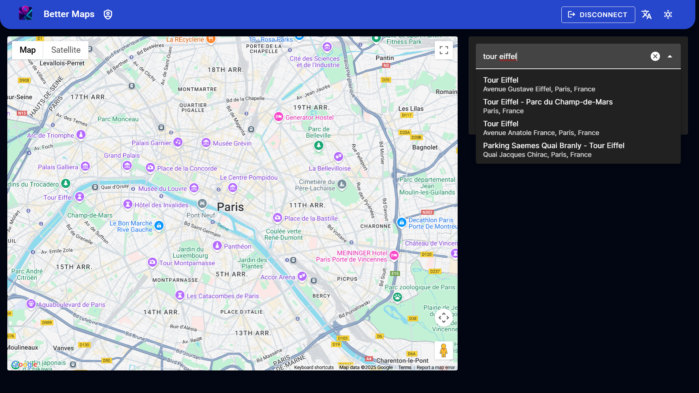
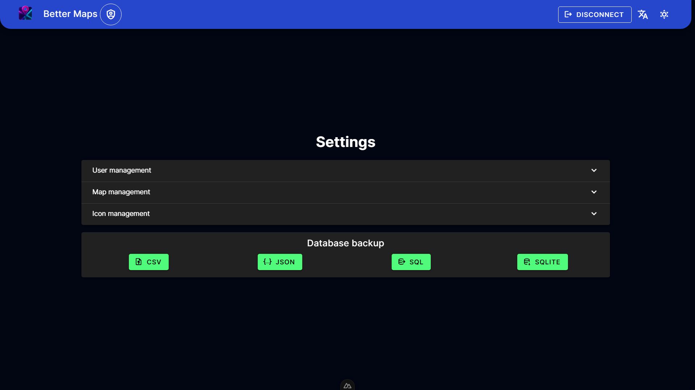

<div align="center">


# better-maps
A quick way to add pin-points to a map, with details, filters and more.  
Made for my gf

</div>

## What is it ?
Basically we needed a way to add custom points on a map. Google Maps works great but the customization is limited, and the UI isn't the best.  
With this app, all you need is to add a point, with a custom name, description and icon/color.  
Search for an existing place or enter an address.  
Toggle the visibility of each point/group of points.  
Toggle the visibility of certain lines of public transportation.  
Every user can access their own map, and a map can be used collaboratively by multiple users.

<details><summary><h2>User documentation</h2></summary>

Hi :wave:  
If you're here, it's probably because you've been sent a link to a hosted version of this app, but don't know how to use it.  
The starting point is the login screen :

Simply enter your username and password.  
> [!NOTE]  
> If you saved your credentials in your browser (especially Chrome), they might not appear as filled, while they are.  
> You can make sure of this by clicking somewhere on the screen.
  
You will then land in the main screen (the map) :


To add a new point, go in the search bar and type the name of the place you want to add :

> [!TIP]  
> If results don't appear, it can be either because there's a small problem in the search (try to untype/retype a character) or because of the aggressive security, try to log out, reload and log back in.
  
You can either search for a specific place, or just enter an address.  
> [!TIP]  
> The results are losely filtered by the visible area of the map, so if you don't find what you're looking for, try to move the map a bit.
  
Once done, you'll have access to the fields to fill in :

Here, you can edit the name, displayed address, description (if you want), the icon type (defined by the instance admin) and if the pin is favorite or not (will have an outline around its icon).


When you click on a pin, a popup window will appear with the pin's details, and it will be highlighted in the pins list as well :


Here's the difference between a normal pin and a favorite pin :


Every pin can be edited :


And deleted, with a confirmation dialog :


Transit lines can be toggled on to display the public transportation lines in the map :


> [!NOTE]  
> Actual transit lines like in the screenshot will only appear on big enough cities.  
> This mode will also prioritize the display of bus stops, metro stations and more at higher zoom levels. Don't hesitate to zoom in to see more details.  
> Disabling the transit lines will display again more details like shops, restaurants, monuments, ...
  

To hide a pin from the map without deleting it, you can click on its icon in the pins list :


Finally, this app is responsive, meaning you can use it on your phone or tablet as well :


On a side note : this app is also available in French (use the language switch in the top right corner) :


And a light mode is also available, if you prefer it :


</details>

<details><summary><h2>Developer documentation</h2></summary>

## Get started
```pwsh
git clone https://github.com/EDM115/better-maps.git
cd better-maps
```
Create a `.env` file in the root directory and add the following variables :
```env
JWT_SECRET=4451b7b6411db0854895824f2fce24721989ac47da45c862cb1baf15383dbc6ef07c1f700304693dde08207bcf75e7e50ad9b146e8bdc4ebf16ade6e6cb9f173
SEED_USERS='[{"username": "admin", "password": "admin", "role": "admin"}, {"username": "test", "password": "test", "role": "user"}]'
SEED_ICONS='[{"name": "Home", "color": "#50FA7B", "icon": "mdi-home-outline"}, {"name": "Groceries", "color": "#8BE9FD", "icon": "mdi-cart-outline"}, {"name": "Schools", "color": "#FF79C6", "icon": "mdi-book-open-variant-outline"}, {"name": "Work", "color": "#BD93F9", "icon": "mdi-bag-personal-outline"}, {"name": "Food", "color": "#F1FA8C", "icon": "mdi-food-outline"}]'
SEED=true
GOOGLE_MAPS_API_KEY=Abc-Def123
STARTING_POINT=48.8566,2.3522,3
COUNTRY=fr
DEFAULT_UI_LANG=en
```
- `JWT_SECRET` : generate with `node -e "import('crypto').then(crypto => console.log(crypto.randomBytes(64).toString('hex')))"`
- `SEED_USERS` : if any value should contain a quote, write instead `\'` (or `\"`)
- `SEED_ICONS` : the color should be a hex color code starting with `#`, the icon should be a Material Design Icon name (`mdi-` + the name of the icon found at [Material Design Icons](https://pictogrammers.com/library/mdi/))
- `STARTING_POINT` : the starting point of the map, in the format `lat,lng,zoom`
- `COUNTRY` : the base country to "limit" the search results, lowercase country code only
- `DEFAULT_UI_LANG` : the default language of the UI, either `en` or `fr`
```pwsh
node --experimental-strip-types init/seed_db.ts
```
Put `SEED` to `false` once the DB is seeded.
```pwsh
pnpm i
pnpm dev
```

## Build and run
```pwsh
docker build --network=host -t edm115/better-maps .
docker run -d -p 27400:27400 --env-file .env -v better_maps_db:/app/db --name better-maps edm115/better-maps
```

## In-app settings
Every admin can access the settings page by clicking on the account shield icon in the navigation bar :


You will be able to edit existing users :


Add new users :


Edit existing maps and add new ones :


As well as edit the icons available for the users to choose from when adding a pin :


And add new ones, with on-the-fly icon preview and validation :


## DB Scheme
### User
| Column   | Type   | Extra                                 |
| :------- | :----- | :------------------------------------ |
| id       | int    | Primary Key, Autoincrement            |
| username | string | Not Null, Unique                      |
| password | string | Not Null                              |
| role     | string | Not Null, "admin" or "user" (default) |
| map_id   | int    | Foreign Key, Not Null                 |

### Map
| Column       | Type   | Extra                                  |
| :----------- | :----- | :------------------------------------- |
| id           | int    | Primary Key, Autoincrement             |
| name         | string | Not Null, "Default Map" (default)      |
| user_id      | int    | Foreign Key, Not Null, can be multiple |
| start_lat    | float  | Not Null                               |
| start_lng    | float  | Not Null                               |
| start_zoom   | int    | Not Null                               |
| country      | string | Not Null, lowercase country code       |
| show_transit | bool   | Not Null, default false                |

### Point
| Column      | Type   | Extra                      |
| :---------- | :----- | :------------------------- |
| id          | int    | Primary Key, Autoincrement |
| name        | string | Not Null                   |
| description | string | Not Null, default ""       |
| address     | string | Not Null                   |
| lat         | float  | Not Null                   |
| lng         | float  | Not Null                   |
| color       | string | Not Null, default ""       |
| icon        | string | Not Null, default "house"  |
| map_id      | int    | Foreign Key, Not Null      |
| visible     | bool   | Not Null, default true     |
| favorite    | bool   | Not Null, default false    |

### Icon
| Column | Type   | Extra                      |
| :----- | :----- | :------------------------- |
| id     | int    | Primary Key, Autoincrement |
| name   | string | Not Null                   |
| color  | string | Not Null                   |
| icon   | string | Not Null                   |

</details>
